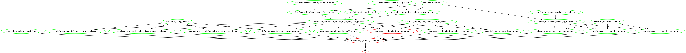
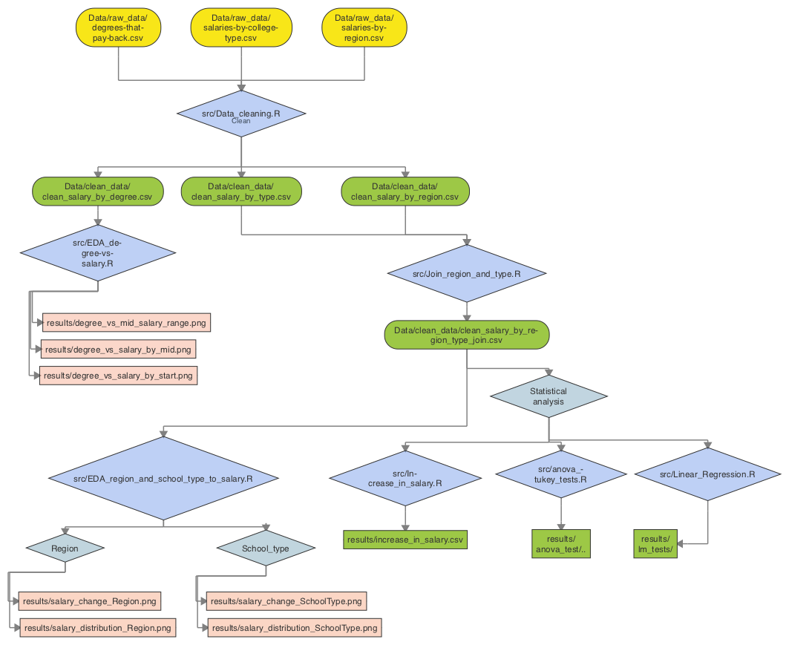

# Do college factors impact salary?

Salary prospects is known to be both an important consideration for high school students when choosing college programs and can be a cause for anxiety for undergraduate students. As such it would be interesting to examine how different colleges compare in the salaries of their graduates and how certain variables may impact salary prospects.

### About the dataset

This project was envisioned and created by students currently participating in the University of British Columbia's Master of Data Science (MDS) program. Many of us chose to participate in the MDS program to augment our undergraduate career goals, which led us to ask the question - which undergraduate programs led to the highest job salaries? Based on conventional wisdom, we assume that the Engineering, Computer Science, and Finance fields are the most well-paid, but is it true?

We chose to analyze a dataset about the salaries of US college graduates organized by college, region, type and major. This is publicly available [dataset](https://www.kaggle.com/wsj/college-salaries) on Kaggle. We decided to explore the dataset and ask whether there are any relationships between college region, type and degree (major) to graduates' salaries. This is an exploratory question.

The original data is from *The Wall Street Journal*, which itself was based on a study done by *Payscale, Inc*.

Original data can be found here:

1. [Salary Increase by Type of College (WSJ)](http://online.wsj.com/public/resources/documents/info-Salaries_for_Colleges_by_Type-sort.html)  
2. [Salaries by Region](http://online.wsj.com/public/resources/documents/info-Salaries_for_Colleges_by_Region-sort.html)  
3. [Salary Increase by Major](http://online.wsj.com/public/resources/documents/info-Degrees_that_Pay_you_Back-sort.html)  

### Importing the data

The original dataset was organized as .csv files. For this project, we will use R to import and handle our data analysis.

Imported data can be found [here](https://github.com/UBC-MDS/DSCI_522_Salary-vs-College/tree/master/data), in the `data/raw_data` folder of our repository. Scripts that handle the data import can be found [here](https://github.com/UBC-MDS/DSCI_522_Salary-vs-College/tree/master/src), in the `src` folder.

### Our plan

1. Perform an exploratory data analysis of the dataset:  
    a. Investigate school region, type, and degree as they relate to graduates' salaries  
    b. Look at different salary end-points: starting salary, mid-career salary, etc.  
    c. Create plots to visualise the distributions of the data   

2. If we find any patterns/differences amongst the groups, we will generate a hypothesis and test it. We will use one-way ANOVA to test for whether any significant differences in salary exist amongst groups of interest (school regions, type, degrees). We will use post-hoc testing (tukey pairwise comparisons) to determine which group is responsible for the difference.   

### Visualizations

To visualize the distribution of the data we plan to use ordered dot plots or dumbbell plots to look at the distribution of salary by school type, region and degree.

We will summarise any differences in graduates' salary within each variable (school region, type, major) using ANOVA in a table. If one-way ANOVA testing shows significant differences, then Tukey pairwise comparisons will be summarised in a table so show which subgroup is responsible for the difference in salary estimates.

### Final Thoughts

The final report can be found [here](https://github.com/UBC-MDS/DSCI_522_Salary-vs-College/blob/master/doc/college_salary_report.md).

After creating several visualizations and hypothesis testing of our data, it turns out our initial assumptions were mostly correct. Engineering disciplines were associated with the highest salaries; Computer Science comes out as a close second. Finance, while not as prevalent as Computer Science or Engineering, still populated the top half of the salary lists.

Two surprising entries are the Physician Assistant and Nursing fields, both of which have a comparatively high starting salary. In the case of Physician Assistants, the starting salary is even higher than the Engineering fields, placing it #1 on the starting salary list. However, both the Physician Assistant and Nursing fields do not have a high mid-career salary, eventually being lower than the Engineering and Computer Science fields.

Based on our analysis, if your objective is to maximize earnings, follow conventional wisdom and choose a career in Engineering, Finance, or Computer Science.

### Release Versions

* Version 1.0 of our project can be found [here](https://github.com/UBC-MDS/DSCI_522_Salary-vs-College/tree/v1.0).
* Version 2.0 of our project can be found [here](https://github.com/UBC-MDS/DSCI_522_Salary-vs-College/tree/V2.0.1).
* Version 3.0 of our project can be found [here](https://github.com/UBC-MDS/DSCI_522_Salary-vs-College/tree/V3.0).
* Version 4.0 (FINAL) of our project can be found [here](https://github.com/UBC-MDS/DSCI_522_Salary-vs-College/tree/V4.0)

Future versions of our project will also be placed here, as it is updated.

### Project reproduction instructions

##### Using Docker  

Docker image on Dockerhub: [lyyu0413/dsci_522_salary-vs-college](https://hub.docker.com/r/lyyu0413/dsci_522_salary-vs-college/)

Download Docker for your operating system. Create a login on Docker Hub and run the following in command line (Terminal or GitBash):
1. `docker pull lyyu0413/dsci_522_salary-vs-college`
2. `docker run --rm -v PATH_ON_YOUR_COMPUTER:/home/dsci_522_salary-vs-college lyyu0413/dsci_522_salary-vs-college make -C '/home/dsci_522_salary-vs-college' clean`
3. `docker run --rm -v PATH_ON_YOUR_COMPUTER:/home/dsci_522_salary-vs-college lyyu0413/dsci_522_salary-vs-college make -C '/home/dsci_522_salary-vs-college' all`


##### Using Make
A Makefile was created and placed in the root directory to easily reproduce our analysis and final report.   
To run this analysis, clone this repository and run the following in the command line (Terminal or GitBash):
1. `make all` to create all the analysis files and final report   
2. `make clean` to delete all the analysis output and final report  

Below is the Makefile Dependency diagram:



##### Manually
Check the Makefile for the order of how the scripts should be run, command line syntax is visible in the Makefile.

The diagram below also shows the overall workflow for the entire project to help understand script order and outputs:



### Directory structure
```
project_root/
├── doc/
│   ├── college_salary_report.md
│   ├── college_salary_report.Rmd
├── src/
│   ├── anova_tukey_tests.R
│   ├── EDA_degree-vs-salary.R
│   ├── EDA_region_and_school_type_to_salary.R
│   ├── Increase_in_salary.R
│   ├── Join_region_and_type.R
│   ├── Linear_Regression.R
│   ├── import_data.R
│   ├── Data_cleaning.R
├── data/
│   ├── clean_data/
│       ├── clean_salary_by_degree.csv
│       ├── clean_salary_by_region.csv
│       ├── clean_salary_by_type.csv
│       ├── clean_salary_by_region_type_join.csv
│   ├── raw_data/
│       ├── degrees-that-pay-back.csv
│       ├── salaries-by-college-type.csv
│       ├── salaries-by-region.csv
├── results/
│   ├── fig.png
│   ├── stat_result.csv
├── Makefile
├── README.md
```
### Imported Data Format

* Degrees-that-pay-back.csv

| Undergraduate Major | Starting Median Salary | Mid-Career Median Salary | Percent change from Starting to Mid-Career Salary | Mid-Career 10th Percentile Salary | Mid-Career 25th Percentile Salary |	Mid-Career 75th Percentile Salary	| Mid-Career 90th Percentile Salary |
|---|---|---|---|---|---|---|---|
| Accounting |  $46,000.00 | $77,100.00 | 67.6 | $42,200.00 | $56,100.00 | $108,000.00 | $152,000.00 |
| Aerospace Engineering	| $57,700.00	| $101,000.00 |	75|	$64,300.00|	$82,100.00|	$127,000.00|	$161,000.00 |
|Agriculture|	$42,600.00|	$71,900.00|	68.8|	$36,300.00|	$52,100.00|	$96,300.00|	$150,000.00|
|...|

* Salaries-by-college-type.csv

|School Name|	School Type|	Starting Median Salary|	Mid-Career Median Salary|	Mid-Career 10th Percentile Salary|	Mid-Career 25th Percentile Salary|	Mid-Career 75th Percentile Salary|	Mid-Career 90th Percentile Salary|
|---|---|---|---|---|---|---|---|
|Massachusetts Institute of Technology (MIT)|	Engineering|	$72,200.00|	$126,000.00|	$76,800.00|	$99,200.00|	$168,000.00|	$220,000.00|
|California Institute of Technology (CIT)|	Engineering	|$75,500.00|	$123,000.00	|N/A|	$104,000.00	|$161,000.00|	N/A
|Harvey Mudd College|	Engineering|	$71,800.00|	$122,000.00	|N/A|	$96,000.00|	$180,000.00	|N/A|
|...|

* Salaries-by-region.csv

|School Name	|Region|	Starting Median Salary|	Mid-Career Median Salary|	Mid-Career 10th Percentile Salary	|Mid-Career 25th Percentile Salary|	Mid-Career 75th Percentile Salary|	Mid-Career 90th Percentile Salary|
|---|---|---|---|---|---|---|---|
|Stanford University|	California|	$70,400.00|	$129,000.00	|$68,400.00|	$93,100.00|	$184,000.00|	$257,000.00|
|California Institute of Technology (CIT)|	California	|$75,500.00	|$123,000.00|	N/A|	$104,000.00	|$161,000.00|	N/A|
|Harvey Mudd College|	California|	$71,800.00|	$122,000.00	|N/A|	$96,000.00|	$180,000.00	|N/A|
|...|
