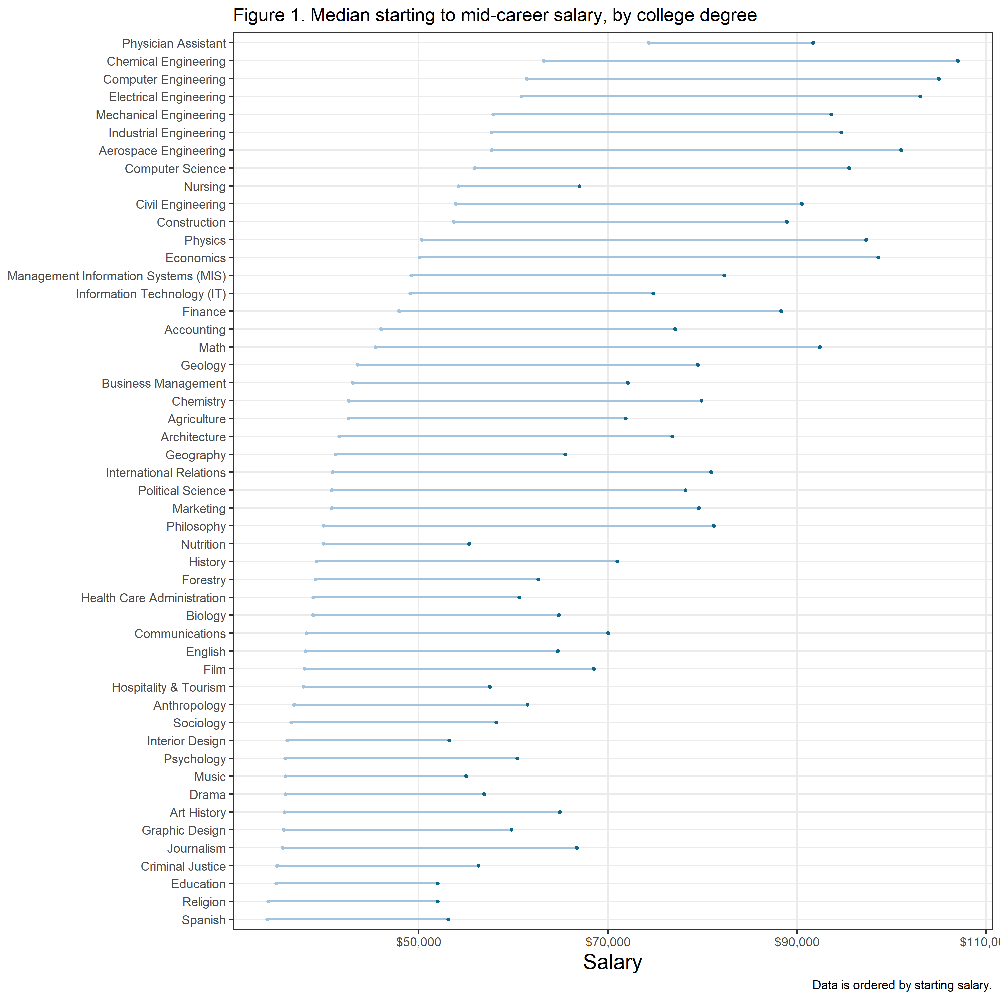
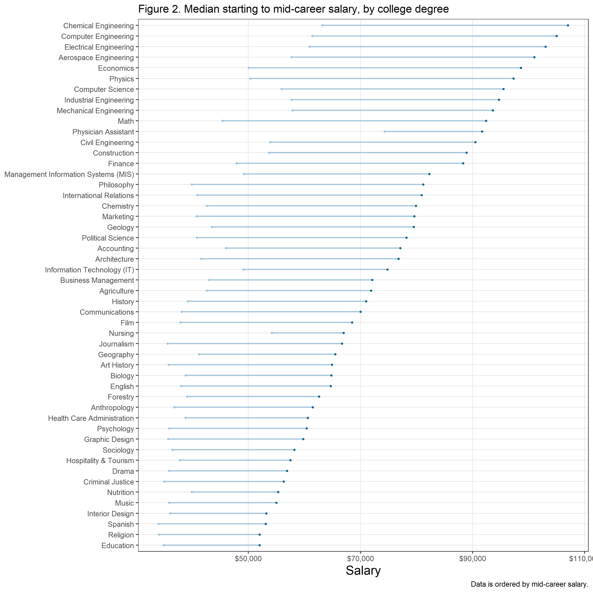
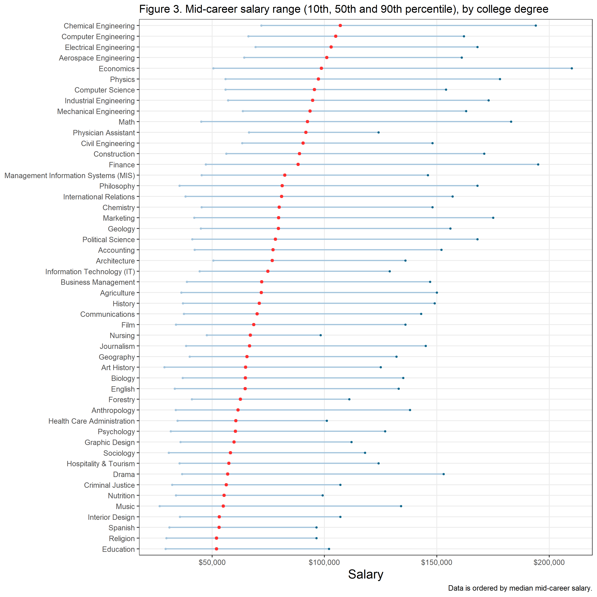
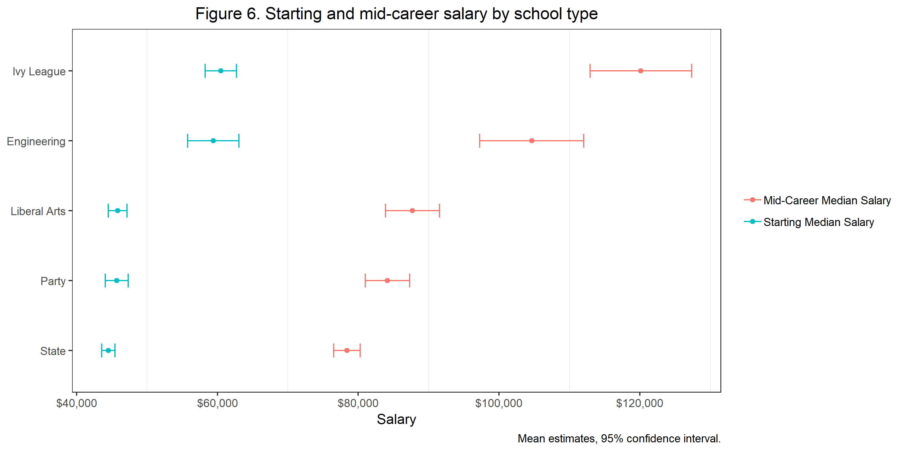

Exploring attributes of US college education in relation to career salary
=========================================================================

**By**: Alex Pak, Linyang Yu, Constantin Shuster
**Date**: November 24, 2018

### Our question

We were interested in exploring whether there are any relationships between certain attributes of US college education and graduates' salaries. Specifically, we analyzed the relationships between college region, type and degree on starting and mid-career salaries. Our question is exploratory and hypothesis generating. If we observed a relationship in the data, we created a hypothesis and tested it.

College region refers to one of the major regions of the US: Northeast, Midwest, South, West and California. College type refers to the main types of colleges in the US: Liberal Arts, Engineering, Ivy League, Party and State colleges. College degree refers to the college major, for example chemical engineering, accounting, etc.

Starting career salary was a median value. Mid-career salary was either 10th, 25, 50th (median), 75th or 90th percentile salary. Mid-career salary was the salary at **10 years** from graduation.

### Our dataset

The dataset was downloaded from [kaggle](https://www.kaggle.com/wsj/college-salaries) and is originally from *The Wall Street Journal* but based on a study done by *Payscale, Inc.*. The data is split into 3 tables. The first table contains College degrees and the corresponding salary data. The second table lists colleges, their region and corresponding salary data. The third table lists colleges, their type and corresponding salary data.

To begin our analysis we cleaned up the data tables by converting character data into numerical data so it can analyzed and visualized appropriately. We removed any spaces in the heading or '$'. We also joined the second two tables such that our joined table listed colleges, their region, their type and corresponding salary data. Since this was an [inner join](https://r4ds.had.co.nz/relational-data.html#inner-join) we lost ~50 colleges that were listed in the third table, but not the second. We wanted the comparison of college region and type with salary to be similar in terms of the colleges listed and so we felt this type of join was appropriate.

### Exploratory data analysis (EDA)

We were first interested in examining how starting and mid-career salaries varied by college degree. Figure 1 and 2 below are [dumbbell plots](http://r-statistics.co/Top50-Ggplot2-Visualizations-MasterList-R-Code.html#Dumbbell%20Plot) where the **starting point** of the dumbbell is the **starting career salary** and the **end point** is the **mid-career salary**. Both salary values are median salaries.

Figure 3 is also a dumbbell plot displaying the range of mid-career salaries by college degree. The range is from 10th to 90th percentile and the median is the point in red. The salary data was ordered by median mid-career salary.

Next we examined how graduates' salaries varied by college region. Figure 4 shows start and mid-career salary data aggregated by college region. The salary data was represented as a mean estimates with standard errors at a 95% confidence interval. The mean estimates were of median start and mid career salaries of colleges in each region that were available in the *joined* table.

Figure 5 shows the mid-career salaries of the different US college regions, split into panels of 10th, 50th and 90th percentiles. We did this to look at whether the same pattern was seen across the full salary range, and whether certain regions were associated with the potential to achieve a higher "top" salary. Salary data was also represented as mean estimates with standard errors at a 95% confidence interval.

Lastly, we examined how graduates' salary varied by college type. Figure 6 and 7 are similar analyses to figure 4 and 5 respectively, only the variable is college type. Salary data was calculated in the exact same manner as described in figure 4 and 5.

### Results

Since we had only 1 data point for each school degree, we could not do any hypothesis testing and thus we report here only major trends we observed in the data from the Figure 1, 2 and 3. From these figures we can see that graduates from STEM majors (Science, Technology and Mathematics) have higher salaries both at the start of their career and in the middle of their career. Graduates with majors in education or the arts/social sciences had the lowest salaries.

In regards to salary variation by school region, our hypothesis from the EDA was that there is a difference in salary depending on which region the college was in. We performed a one-way ANOVA shown in Table 1 below.

    ## Parsed with column specification:
    ## cols(
    ##   Salary_Type = col_character(),
    ##   F_Statistic = col_double(),
    ##   P_Value = col_double()
    ## )

| Salary Type                           |  F Statistic|       p-value|
|:--------------------------------------|------------:|-------------:|
| Starting\_Median\_Salary              |        12.10|  3.398112e-09|
| Mid\_Career\_Median\_Salary           |        17.38|  5.700000e-13|
| Mid\_Career\_10th\_Percentile\_Salary |         8.71|  1.187212e-06|
| Mid\_Career\_25th\_Percentile\_Salary |        12.69|  1.246776e-09|
| Mid\_Career\_50th\_Percentile\_Salary |        17.38|  5.700000e-13|
| Mid\_Career\_75th\_Percentile\_Salary |        18.28|  1.340000e-13|
| Mid\_Career\_90th\_Percentile\_Salary |        13.88|  2.306060e-10|

**Table 1** above shows there was a statistical difference in salary, all salary types examined, amongst the different regions, with a p-value &lt; 0.05. Next we performed a Tukey's post-hoc test to see which region was responsible for the difference in salary. Summary is presented in Table 2 below. To shorthen the table, we just filter the conbination with significant difference.

    ## Parsed with column specification:
    ## cols(
    ##   salary_type = col_character(),
    ##   term = col_character(),
    ##   comparison = col_character(),
    ##   adj.p.value = col_double(),
    ##   flag = col_character()
    ## )

| Salary Type                           | Region Comparison       |  adjusted p-value| Interpretation |
|:--------------------------------------|:------------------------|-----------------:|:---------------|
| Starting\_Median\_Salary              | Midwestern-California   |         0.0000090| \*\*\*         |
| Starting\_Median\_Salary              | Southern-California     |         0.0000114| \*\*\*         |
| Starting\_Median\_Salary              | Western-California      |         0.0001087| \*\*\*         |
| Starting\_Median\_Salary              | Northeastern-Midwestern |         0.0001491| \*\*\*         |
| Starting\_Median\_Salary              | Southern-Northeastern   |         0.0001654| \*\*\*         |
| Starting\_Median\_Salary              | Western-Northeastern    |         0.0040647| \*\*           |
| Mid\_Career\_Median\_Salary           | Midwestern-California   |         0.0000119| \*\*\*         |
| Mid\_Career\_Median\_Salary           | Southern-California     |         0.0000756| \*\*\*         |
| Mid\_Career\_Median\_Salary           | Western-California      |         0.0000723| \*\*\*         |
| Mid\_Career\_Median\_Salary           | Northeastern-Midwestern |         0.0000000| \*\*\*         |
| Mid\_Career\_Median\_Salary           | Southern-Northeastern   |         0.0000003| \*\*\*         |
| Mid\_Career\_Median\_Salary           | Western-Northeastern    |         0.0000033| \*\*\*         |
| Mid\_Career\_10th\_Percentile\_Salary | Northeastern-Midwestern |         0.0000735| \*\*\*         |
| Mid\_Career\_10th\_Percentile\_Salary | Southern-Northeastern   |         0.0000335| \*\*\*         |
| Mid\_Career\_10th\_Percentile\_Salary | Western-Northeastern    |         0.0022340| \*\*           |
| Mid\_Career\_25th\_Percentile\_Salary | Midwestern-California   |         0.0002520| \*\*\*         |
| Mid\_Career\_25th\_Percentile\_Salary | Southern-California     |         0.0003383| \*\*\*         |
| Mid\_Career\_25th\_Percentile\_Salary | Western-California      |         0.0005099| \*\*\*         |
| Mid\_Career\_25th\_Percentile\_Salary | Northeastern-Midwestern |         0.0000118| \*\*\*         |
| Mid\_Career\_25th\_Percentile\_Salary | Southern-Northeastern   |         0.0000118| \*\*\*         |
| Mid\_Career\_25th\_Percentile\_Salary | Western-Northeastern    |         0.0001312| \*\*\*         |
| Mid\_Career\_50th\_Percentile\_Salary | Midwestern-California   |         0.0000119| \*\*\*         |
| Mid\_Career\_50th\_Percentile\_Salary | Southern-California     |         0.0000756| \*\*\*         |
| Mid\_Career\_50th\_Percentile\_Salary | Western-California      |         0.0000723| \*\*\*         |
| Mid\_Career\_50th\_Percentile\_Salary | Northeastern-Midwestern |         0.0000000| \*\*\*         |
| Mid\_Career\_50th\_Percentile\_Salary | Southern-Northeastern   |         0.0000003| \*\*\*         |
| Mid\_Career\_50th\_Percentile\_Salary | Western-Northeastern    |         0.0000033| \*\*\*         |
| Mid\_Career\_75th\_Percentile\_Salary | Midwestern-California   |         0.0004712| \*\*\*         |
| Mid\_Career\_75th\_Percentile\_Salary | Southern-California     |         0.0022936| \*\*           |
| Mid\_Career\_75th\_Percentile\_Salary | Western-California      |         0.0004535| \*\*\*         |
| Mid\_Career\_75th\_Percentile\_Salary | Northeastern-Midwestern |         0.0000000| \*\*\*         |
| Mid\_Career\_75th\_Percentile\_Salary | Southern-Northeastern   |         0.0000000| \*\*\*         |
| Mid\_Career\_75th\_Percentile\_Salary | Western-Northeastern    |         0.0000001| \*\*\*         |
| Mid\_Career\_90th\_Percentile\_Salary | Northeastern-Midwestern |         0.0000000| \*\*\*         |
| Mid\_Career\_90th\_Percentile\_Salary | Southern-Northeastern   |         0.0000021| \*\*\*         |
| Mid\_Career\_90th\_Percentile\_Salary | Western-Northeastern    |         0.0000005| \*\*\*         |

**Table 2** above shows that graduates of colleges in the Northeast and California had higher salaries than the other regions, however there was no statistically significant difference at alpha = 0.05 between colleges in the Northeast and California.

In regards to salary variation by school type, our hypothesis from the EDA was that there is a difference in salary depending on which college type a graduate attended. We performed a one-way ANOVA shown in Table 1 below.

    ## Parsed with column specification:
    ## cols(
    ##   Salary_Type = col_character(),
    ##   F_Statistic = col_double(),
    ##   P_Value = col_double()
    ## )

| Salary Type                           |  F Statistic|     p-value|
|:--------------------------------------|------------:|-----------:|
| Starting\_Median\_Salary              |        66.81|  0.0000e+00|
| Mid\_Career\_Median\_Salary           |        54.69|  0.0000e+00|
| Mid\_Career\_10th\_Percentile\_Salary |        42.43|  2.5089e-26|
| Mid\_Career\_25th\_Percentile\_Salary |        51.27|  0.0000e+00|
| Mid\_Career\_50th\_Percentile\_Salary |        54.69|  0.0000e+00|
| Mid\_Career\_75th\_Percentile\_Salary |        64.17|  0.0000e+00|
| Mid\_Career\_90th\_Percentile\_Salary |        57.32|  0.0000e+00|

**Table 3** above shows that there was a significant difference in salary amongst different types of schools as the p-value in all comparisons with different salary types was &lt;0.05.

    ## Parsed with column specification:
    ## cols(
    ##   salary_type = col_character(),
    ##   term = col_character(),
    ##   comparison = col_character(),
    ##   adj.p.value = col_double(),
    ##   flag = col_character()
    ## )

| Salary Type              | Region Comparison        |  adjusted p-value| Interpretation |
|:-------------------------|:-------------------------|-----------------:|:---------------|
| Starting\_Median\_Salary | Liberal Arts-Engineering |                 0| \*\*\*         |
| Starting\_Median\_Salary | Party-Engineering        |                 0| \*\*\*         |
| Starting\_Median\_Salary | State-Engineering        |                 0| \*\*\*         |
| Starting\_Median\_Salary | Liberal Arts-Ivy League  |                 0| \*\*\*         |
| Starting\_Median\_Salary | Party-Ivy League         |                 0| \*\*\*         |

The results of the Tukey post-hoc tests show that graduates from colleges in Ivy Leagues school and Engineering schools had higher salaries than the other school types, however there was no significant difference between graduates of Ivy League and Engineering schools.

### Interpretation

When comparing Degrees to Salary, the Engineering fields consistently appear as the top earners. Of the top 10 spots (when comparing starting salary), Engineering degrees dominate, appearing in 7/10 spots. Although this might imply that STEM fields are high earners, it seems to only apply to the applied STEM field; for example, the more conventional science fields such as psychology and biology fall much lower on the list.

Looking at the Tukey procedure results for Region vs. Salary, the Northeastern and California seem to have similar means, as the null hypothesis consistently cannot be rejected across multiple salary types. This seems to make sense, as California and the Northeastern region contain highly rated schools (ex. Stanford, California Institute of Technology, Harvard).

The Tukey procedure results for School Type vs Salary seems to follow this interpretation. From the visualizations, Ivy League schools consistently place highly on the salary scale. However, when using the Tukey procedure, it seems as if there is no significant difference between the Ivy League school earnings and Engineering school earnings, suggesting once again that Engineering degrees are worth the most.

### Limitations

One of the major limitations of our analysis was that for the dataset we chose, the individual datapoints for each salary were not given. Instead, the medians for each salary type were pre-calculated and tabulated into this dataset. This meant that: \* We had to take the dataset as the absolute truth since we could not calculate the medians ourselves, and \* We could not see the spread of the datapoints (ie. summary statistics, or visualizing the data as a boxplot).

Although the median is a robust summary statistic (compared to the mean, for example), it would have made our analysis more trustworthy if we were able to view and manipulate the individual datapoints.

Another limitation of our analysis is that ANOVA tests assume an equal variance between all levels of a factor. In our analysis, we did not check this assumption before performing the ANOVA tests.

### Future directions

In the future, to check the credibility of our ANOVA test, we can perform a Levene's Test. A Levene's Test assess the equality of variances between different factors. If our dataset passes the Levene's Test, it would add extra credibility to our ANOVA results.

Another potential visual exploration for our dataset would be to import a seperate dataset containing all US College names and the state they are based in (one such example can be found [here](https://trends.collegeboard.org/college-pricing/figures-tables/tuition-fees-flagship-universities-over-time)). By joining the state names to the college names in our dataset, we would be able to create a visual map of the United States, with each state containing salary information on a colour scale.

To further enhance our analysis, we could compare the top performing degrees in the States with the top performing degrees in Canada. It would be interesting to see differences in top degrees and the differences in starting/mid-career salaries between Canadian universities and colleges in the States (or if there is even a difference at all).

### References

1.  [Kaggle Data - College vs Salary](https://www.kaggle.com/wsj/college-salaries)
2.  [Dumbbell plots explained](http://r-statistics.co/Top50-Ggplot2-Visualizations-MasterList-R-Code.html#Dumbbell%20Plot)
